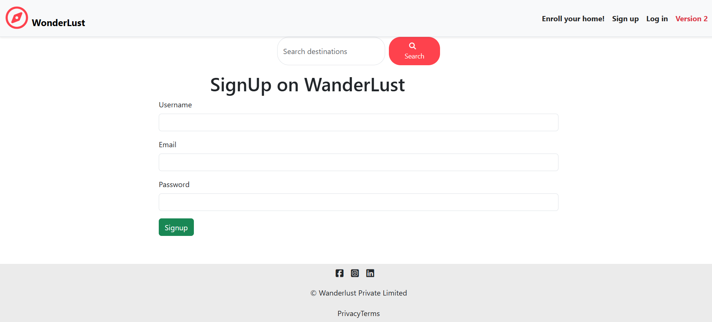

# Wonderlust-Retreats
Wonderlust Rentals is a seamless platform connecting users to verified rentals, from vacation homes to vehicles and workspaces. With secure transactions, instant bookings, and smart search filters, it makes renting easy and hassle-free. Explore, book, and enjoy a smooth rental experience!


🔗 **Live Demo**: [Click Here](https://wonderlust-retreats.up.railway.app/listings)  

---

## ✨ Features

- 🔐 User authentication & session management  
- 📝 Create, edit, and delete travel listings  
- 📸 Upload multiple listing images (via Cloudinary + Multer)  
- 🗺️ Interactive maps with Mapbox (convert location → coordinates)  
- 💬 Review & comment system  
- 📱 Responsive UI across devices  
- ⚡ Flash messages for success/error feedback  
- 🗂️ Filter listings by categories (domes, castles, trending, beach, pools, etc.)

---

## 🚀 Version 2 Features (in progress)

- 💳 Payment integration for bookings  
- 🗂️ Advanced search & filtering  
- ⭐ Ratings system for listings  
- 📊 Dashboard for managing listings and reviews  
- 🔔 Notification system  

---

## 🛠️ Tech Stack

- **Frontend**: EJS, Bootstrap 5  
- **Backend**: Node.js, Express.js  
- **Database**: MongoDB Atlas (Cloud)  
- **Deployment**: Railway (frontend + backend)  
- **Image Storage**: Cloudinary  
- **Maps**: Mapbox  

---

## 📸 Screenshots

| Homepage | Listing Page | Map Integration |
|----------|--------------|-----------------|
|  |  |  |

| Add New Listing | Reviews Section | Responsive UI |
|-----------------|-----------------|---------------|
|  |  |  |

---

## ⚡ Installation

1. Clone the repo  
   ```bash
   git clone https://github.com/yourusername/your-repo-name.git
   cd your-repo-name
   ```

2. Install dependencies  
   ```bash
   npm install
   ```

3. Add your environment variables in `.env`  
   ```bash
   MONGO_URI=your_mongodb_uri
   CLOUDINARY_KEY=your_key
   CLOUDINARY_SECRET=your_secret
   MAPBOX_TOKEN=your_token
   ```

4. Run the project  
   ```bash
   npm start
   ```

---

## 📬 Feedback & Contributions

I’d love to hear your feedback!  
If you have suggestions or want to contribute, feel free to open an issue or pull request.  

---


## 🙌 Support

If you enjoyed exploring this project or found it useful, please give it a ⭐  
Your support keeps me motivated to build more projects like this.

---

### 🙏 Acknowledgments
Thanks to **Shradha Khapra & Apna College** for their amazing web development roadmap and teaching style that inspired this project.

